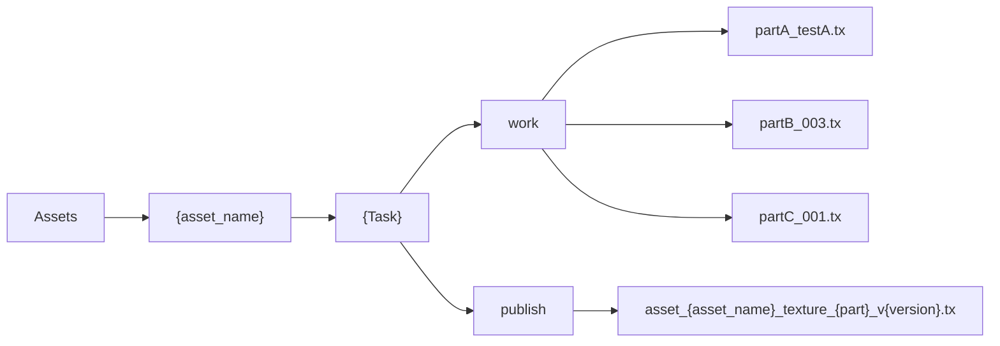

## Description

A Code Test dedicated to the interview.

## Pre-requirements

- Create an [account](https://gitlab.com/users/sign_in) on GitLab.
- Install [Python 2.7.X](https://www.python.org/downloads/).
- Install [Git](https://git-scm.com/book/en/v2/Getting-Started-Installing-Git).
  - At the end of the README, you will find a
  [Git Snippets](./README.md#git-snippets) Section.
- Add a [SSH key to your GitLab account](https://docs.gitlab.com/ee/gitlab-basics/create-your-ssh-keys.html).
- Send us your GitLab account by email and the start date for the test.
  - You have **4 days** to do the test from the date of departure you have decided.

## The Test

### Get The Repository Locally

- Git Clone the repository, replace {yourname}.
- `git clone git@gitlab.com:sps_coding_test/code_test_a__{yourname}.git`
- Create a new branch
- `git checkout -b {yourname}`

### Exercise

- In the context of surfacing our artist has made some awesome textures like `partA_texture.tx`.
- A tool has inspected the scene and has produced a `texture_assignment.yaml`
file which describes which file is used by the Scene.
- Our goal is to publish the work textures described in the `texture_assignment.yaml`
into the publish folder.
  - In our case the file to publish are :
    - Assets/myAssetB/surfacing/work/partA_testA.tx
    - Assets/myAssetB/surfacing/work/partB_003.tx
    - Assets/myAssetB/surfacing/work/partC_001.tx
- In the publish folder we must respect the naming convention defined in
the Tech Spec Section.
- NB : Texture files are not real image to stay light ;)

Visually the files are represented like below.



### Tech Spec

- The work texture must follow the naming convention `{part}_{whatever}.tx`,
that allow us to easily discover the part name.
- The publish texture path must follow the naming convention
  - `Assets/{asset_name}/{task}/publish/asset_{asset_name}_texture_{part}_v{version}.tx`
  - where the `Assets` folder is under the `project`folder in this repository.
  - where `{asset_name}` is `myAssetB`.
  - where `{task}` is `surfacing`.
  - where `{part}` is determined by the work texture name.
  - where `{version}` must be represented by 3 digits and start at 1,
  so the first version is v001.
- A work texture may have already been published, we do not want to republish it.
- A published texture should never be overwritten.

### Code Spec

- We respect the [PEP8](https://www.python.org/dev/peps/pep-0008/) coding style.
- We use `snake_case`.
- We use flake8 with the setup.cfg file.`.pylintrc` file is included in this repository.
- You can use the logger declared in the `code_test`package
with `from code_test import LOG`.
- You can use all the modules you think necessary.
- We love **Documentation**, so please document your code.
  - Take the `publish_texture` function as an example of docstring.
- At the end, we expect to launch the command

  ``` python
  from code_test import main as ctm
  ctm.publish_texture(
      asset_name="myAssetB",
      task="surfacing",
      tex_assign_file="/my_path_to_the_file/texture_assignment.yaml"
  )
  ```

- And get a result with this schema.

  ``` python
  result = {
      "published": [
          {"work": path, "publish": path},
          {"work": path, "publish": path},
          {"work": path, "publish": path},
      ],
      "already-published": [
          {"work": path, "publish": path},
          {"work": path, "publish": path}
      ],
      "failed": [
          {"work": path, "error": detail},
          {"work": path, "error": detail}
      ],
  }
  ```

## At the End

- [Commits](https://git-scm.com/docs/git-commit) your code.
- Push your code on GitLab in the same branch.
  - `git push origin {yourname}`
- Of course, a good practice is to do Commits and Pushes regularly just
in case your computer catches fire.
- Create a [Merge Request](https://docs.gitlab.com/ee/gitlab-basics/add-merge-request.html)
{yourbranch} > master
- And shoot an email
  - Subject : "Code Test : Done"
  - And give me some explanations about your code if necessary.

## Git Snippets

### List modified files and not committed

At the root of the repository.

- `git status`
- you can see something like

  ```bash
  On branch {yourname}
  Your branch is up to date with 'origin/yourname'.

  Changes not staged for commit:
  (use "git add <file>..." to update what will be committed)
  (use "git checkout -- <file>..." to discard changes in working directory)

          modified:   code_test/main.py

  no changes added to commit (use "git add" and/or "git commit -a")
  ```

### Commit your code (locally)

At the root of the repository.

- `git commit code_test/main.py -m "{your message}"`

### Push the commits on the GitLab Server.

At the root of the repository.
After checking with `git status` if all the code you wanted to push on
the server has been committed. You can launch a

- `git push origin {yourname}`

### Remove your changes

At the root of the repository.
You made some modifications to the file but you want to restart your work.
And start with the file at its origin.
You can use a

- `git checkout code_test/main.py`
